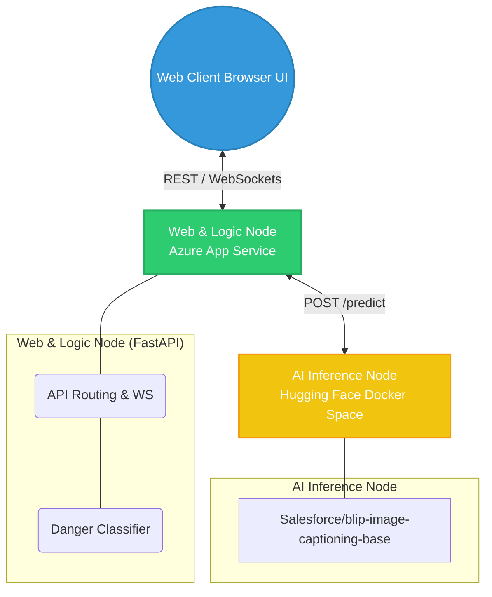
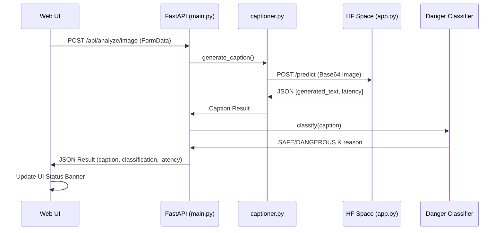
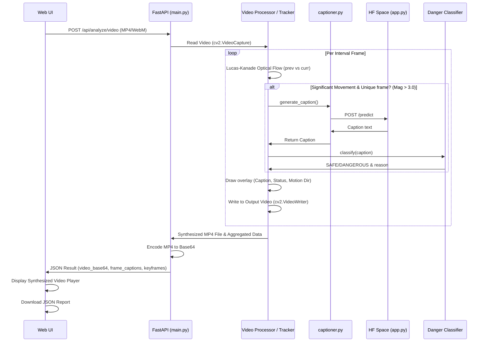
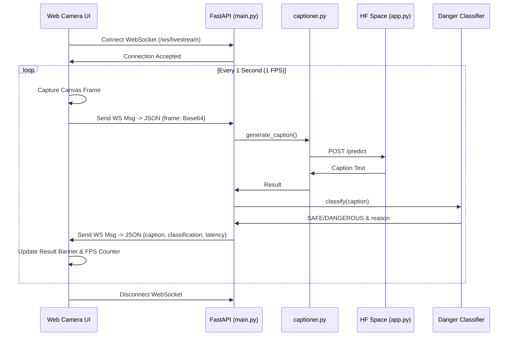

# VisionAssist: AI-Powered Scene Description & Danger Detection

VisionAssist is a real-time web application designed to help visually impaired individuals by analyzing scenes (static images or live camera feeds) and providing descriptive captions along with potential hazard classifications.

## 🌟 Features

*   **Real-Time Processing:** Supports uploading static images or utilizing a live camera feed via WebSockets for instantaneous analysis.
*   **AI Scene Description:** Uses advanced Vision-Language Models (like the Hugging Face `Salesforce/blip-image-captioning-base` or equivalent APIs) to generate accurate natural language descriptions of the scene.
*   **Danger Detection:** Classifies generated captions to determine if a scene is `SAFE` or `DANGEROUS` (e.g., detecting obstacles, holes, or oncoming traffic).
*   **Motion Tracking (Optical Flow):** Employs Lucas-Kanade Optical Flow to determine motion direction and magnitude (Approaching, Moving Left/Right), providing richer contextual danger alerts.
*   **Video Synthesis & Reporting:** Extracts distinct keyframes from uploaded videos, overlays analysis and danger statuses directly onto the synthesized output video, and offers a downloadable JSON summary report.
*   **Premium Web Interface:** A beautifully designed, responsive, and accessible dark-themed UI built with modern CSS (glassmorphism, micro-animations) and vanilla JavaScript.
*   **Cloud Ready:** Fully containerized with Docker and includes comprehensive guides for deploying to Microsoft Azure or Render.

## 🛠️ Tech Stack

*   **Frontend:** HTML5, CSS3 (Custom Variables, Flexbox/Grid, Animations), Vanilla JavaScript (WebSockets, Fetch API).
*   **Backend:** Python 3.11+, FastAPI, Uvicorn, WebSockets.
*   **Computer Vision:** OpenCV (Video processing, Keyframe extraction, Lucas-Kanade Optical Flow).
*   **Machine Learning:** PyTorch, Transformers (Hugging Face).
*   **Deployment:** Docker, Azure App Services / Azure Container Apps / Render.

## 🏗️ Architecture

To ensure 100% free uptime and bypass hardware limitations on standard cloud providers, VisionAssist employs a **Dual-Node Architecture**:

1.  **AI Inference Node (Hugging Face Spaces):** A dedicated, private Docker Space running `Salesforce/blip-image-captioning-base` locally on a free 16GB RAM instance. It exposes a single FastAPI endpoint that strictly processes `base64` images into text captions.
2.  **Web & Logic Node (Microsoft Azure):** An Azure App Service that hosts the beautiful Frontend UI and the primary Python Backend. This node receives images/video/livestreams from the user, forwards the frames to the Hugging Face Space API, and performs text-based danger classification on the returned captions.

### System Diagram



### Feature Workflows

#### Static Image Analysis


#### Video Analysis (Synthesis & Reporting)


#### Live Camera Stream Analysis


## 📁 Project Structure

```text
📦 Microsoft-Azure-Demo
 ┣ 📂 hf_space_api/            # Dedicated Hugging Face Space Server (AI Inference Node)
 ┃ ┣ 📜 app.py                 # Standalone API loading BLIP-Base locally
 ┃ ┣ 📜 Dockerfile             # Container configuration for HF Spaces
 ┃ ┗ 📜 requirements.txt       # Dependencies (transformers, torch, etc.)
 ┣ 📂 notebooks/               # Jupyter Notebooks for testing and evaluation
 ┣ 📂 src/
 ┃ ┣ 📂 backend/               # Main Azure Server (Web & Logic Node)
 ┃ ┃ ┣ 📜 main.py              # Main API and WebSocket routes (Video & Live Camera handling)
 ┃ ┃ ┣ 📜 captioner.py         # Routes requests to the HF Space API
 ┃ ┃ ┣ 📜 classifier.py        # Danger classification and context logic
 ┃ ┃ ┣ 📜 motion_tracker.py    # Lucas-Kanade Optical Flow tracking logic
 ┃ ┃ ┗ ...
 ┃ ┗ 📂 frontend/              # Premium User Interface
 ┃   ┣ 📜 index.html           # Main UI layout
 ┃   ┣ 📜 style.css            # Styling and animations
 ┃   ┗ 📜 app.js               # Frontend logic and API/WebSocket connectivity
 ┣ 📜 azure-deploy.md          # Comprehensive Azure cloud deployment guide
 ┣ 📜 Dockerfile               # Container configuration for Azure backend and frontend
 ┗ 📜 requirements.txt         # Azure node Python dependencies
```

## 🚀 Getting Started Locally

### Prerequisites

*   Python 3.11 or higher
*   Git

### 1. Setup the AI Inference Node (Hugging Face Spaces)
1. Go to [Hugging Face Spaces](https://huggingface.co/spaces) and create a new **Docker (Blank)** Space.
2. Upload the 3 files found in the `hf_space_api/` directory (app.py, Dockerfile, requirements.txt) to your new Space.
3. Once the Space is `Running`, copy its URL (e.g., `https://username-spacename.hf.space`).
4. Paste this URL into `src/backend/captioner.py` replacing the `api_url` variable.

### 2. Setup the Web Node (Local / Azure)

1.  **Clone the repository:**
    ```bash
    git clone https://github.com/Ahmed-7-ML/RealTime_Scene_Description.git
    cd RealTime_Scene_Description
    ```

2.  **Create and activate a virtual environment:**
    ```bash
    python -m venv venv
    # Windows
    venv\Scripts\activate
    # macOS/Linux
    source venv/bin/activate
    ```

3.  **Install dependencies:**
    ```bash
    pip install -r requirements.txt
    ```

4.  **Start the Main Server:**
    ```bash
    uvicorn src.backend.main:app --host 0.0.0.0 --port 8000 --reload
    ```
    The full application (Frontend + Backend) is now accessible at `http://localhost:8000`.

## ☁️ Deployment

This project is configured for split deployment:
1.  **AI Node**: Deployed to **Hugging Face Spaces** (Docker environment).
2.  **Web Node**: Deployed automatically to **Microsoft Azure App Service** (Linux/Python 3.11) via GitHub Actions (`.github/workflows`).

Please refer to the **[Azure Deployment Guide](./azure-deploy.md)** for detailed instructions on the Azure setup, avoiding common pitfalls like `ZIP Deploy 409 Conflicts` or Kudu timeouts.

## 📝 License

This project is created for educational and demonstration purposes.
